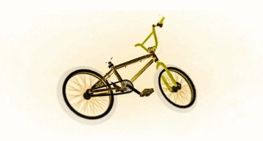

# 介绍

<figure><figcaption></figcaption></figure>

## **本wiki仅适用于GTA5 BMX玩家** 

***

GTA5BMX作为一个玩家自主发掘的全新的动作游戏玩法，虽然依附在GTA5这款经典的冒险通关游戏中，但是它独特的玩法深深地吸引了一些具有挑战欲的玩家，以其上墙、地滑、滑竿、轮滑、壁走、拍地等技巧开创了游戏界的新纪元。


由于2023年6月之后的数次脑瘫更新，bmx已被改的“面目全非”，大多数毒图已无法正常游玩



如何迁移至bmx竞速/特技的FiveM多人私服，请参阅本wiki的左侧导航栏\~


群组链接: 🎮[Discord Group](https://discord.com/invite/ryAE73x)&#x20;

~~_QQ注销卸载了，没有QQ群_~~
