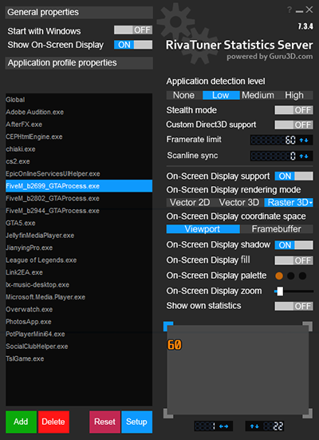

---
layout:
  title:
    visible: false
  description:
    visible: false
  tableOfContents:
    visible: true
  outline:
    visible: true
  pagination:
    visible: true
---

# 安装本体

## <mark style="color:blue;">**1.打开Discord**</mark> 

***

<mark style="color:orange;">（可选）</mark>加入[discord群](https://discord.com/invite/ryAE73x)，然后也许你想将discord账号绑定至FiveM，[参考视频](https://www.youtube.com/watch?v=SWD2q0JKRCc)（跳转Youtube）

## <mark style="color:blue;">**2.Fivem下载**</mark> 

***

<mark style="color:green;">（必须）</mark>下载地址[https://fivem.net/](https://fivem.net/)

<mark style="color:orange;">（可选）</mark>把下载下来的文件放到你想安装的目录


运行后会在同目录生成名为“FiveM Application Data”的文件夹，后续如果需要装[MOD](page-2-mod.md#hua-zhi-mod)，也是在这个路径内


## <mark style="color:blue;">**3.打开FiveM**</mark> 

***

<mark style="color:green;">（必须）</mark>账号里需要有正版GTA5，会提示验证R星的账号

<mark style="color:orange;">（可选）</mark>注册Fivem的cfx.re账号

<mark style="color:orange;">（可选）</mark>在FiveM设置中修改用户名，仅允许英文字母、数字和空格

| ✅ | iamabc   | iamabc123     | i am abc |
| - | -------- | ------------- | -------- |
| ❌ | i.am.abc | i\_am\_abc123 | 我是玩家     |

## <mark style="color:blue;">**4.加入游戏**</mark> 

***

🌐服务器 1: 洛圣都

[https://servers.fivem.net/servers/detail/pm5lv8](https://servers.fivem.net/servers/detail/pmd3qa)_(不定期更换连接地址)_

🌐服务器 2: 自由城

[https://servers.fivem.net/servers/detail/ro3zq7](https://servers.fivem.net/servers/detail/ro3zq7)_(不定期更换连接地址)_

🌐服务器 3: 罪恶都市(暂不开放)

***

## <mark style="color:blue;">**5.部分按键绑定和命令参考**</mark> 

***

| **键盘** | **手柄**    | **说明**      |
| ------ | --------- | ----------- |
| M      | 返回键长按0.5秒 | 刷车/改装载具/传送等 |
| F5     | /         | 作图/搬图       |
| F6     | /         | 玩图/中途加入     |
| F7     | /         | 接受邀请        |
| ESC    | /         | 退出竞速        |
| \[     | 十字键🔽     | 传送到记录点      |
| ]      | 十字键🔼     | 记录特技地点      |
| Z      | 十字键🔽     | 切换计分板       |

## ⚠️<mark style="color:blue;">**特别注意**</mark> 

***

### **锁帧** 

***

微星小飞机下载地址

[www.msi.com/Landing/afterburner/graphics-cards](https://www.msi.com/Landing/afterburner/graphics-cards)

注意: 一定要选择<mark style="color:red;">FiveM\_b2699\_GTAProcess.exe</mark>，而不是GTA5.exe

（软件使用教程自行搜索）

### **其他设置** 

***

请打开本wiki的左侧导航栏，或者在[cfx.re](https://forum.cfx.re/)论坛搜索关键词
