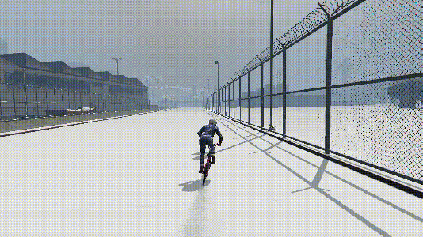
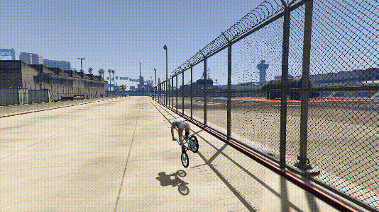
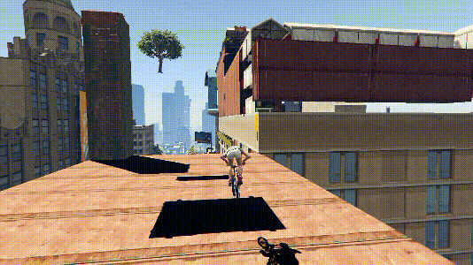
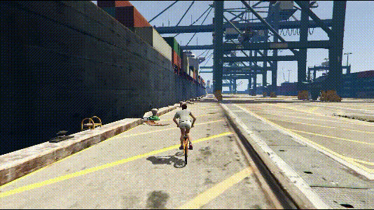
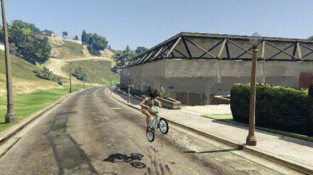
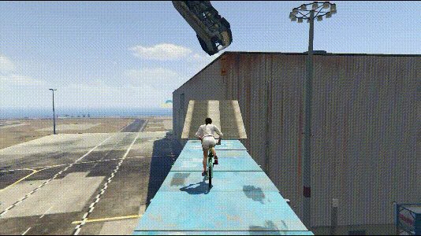
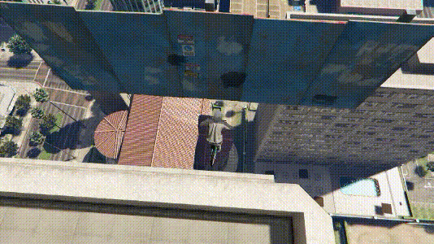
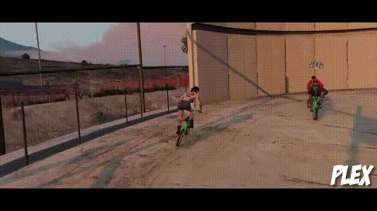

---
layout:
  title:
    visible: false
  description:
    visible: false
  tableOfContents:
    visible: true
  outline:
    visible: true
  pagination:
    visible: true
---

# 直面壁走

> 值得注意的是，由于直面壁走和曲面壁走的方法互通，都可以互相使用，所以这里所说的壁走包括直面壁走和曲面壁走，只是省略了不常见的曲面壁走

## <mark style="color:blue;">**前压壁走**</mark>🕹️ <a href="#qian-ya-bi-zou" id="qian-ya-bi-zou"></a>

***

### **反动壁走（不拱）** <a href="#fan-dong-bi-zou-bu-gong" id="fan-dong-bi-zou-bu-gong"></a>

***

提前预习下操作画面，在下面的反动壁走（前压拱）再详细讲诉方法，只是省略了蓄力跳（拱）的部分

<div align="left">

<figure><figcaption></figcaption></figure>

</div>

### **反动壁走（前压拱）** <a href="#fan-dong-bi-zou-qian-ya-gong" id="fan-dong-bi-zou-qian-ya-gong"></a>

***

<div align="left">

<figure><figcaption></figcaption></figure>

</div>

🔎详细操作方法：

结合普通跳跃里[反动跳](page-1-jumps.md#fan-dong-tiao)操作，即空中先左后右（或先右后左），落地执行砸车头操作，让前轮触及所要壁走的面，然后适当前压+蓄力跳（此处蓄力跳看成一个拱）

* 砸起车头前，前推一定不能松
* 砸起车头后，后拉到gif演示的角度，但是不要后拉太多减速了
* 速度快+动作流畅，有助于提高成功率

```plaintext
键盘：方向按键+空格
手柄：左摇杆+RB/R1
```

> 只有这里细分拱不拱，其他方法不细分

### **直接跳起接前压壁走** <a href="#zhi-jie-tiao-qi-jie-qian-ya-bi-zou" id="zhi-jie-tiao-qi-jie-qian-ya-bi-zou"></a>

***

一个最简化版本的前压壁走

<div align="left">

<figure><figcaption></figcaption></figure>

</div>

* 在速度足够的情况下，才能直接起跳摆出前压壁走

### **砸车头接前压壁走** <a href="#za-che-tou-jie-qian-ya-bi-zou" id="za-che-tou-jie-qian-ya-bi-zou"></a>

***

普通砸车头代替反动跳的反动壁走

<div align="left">

<figure><figcaption></figcaption></figure>

</div>



成功率比较低



受帧数和墙壁材质的影响大


### **拍地接前压壁走** <a href="#pai-di-jie-qian-ya-bi-zou" id="pai-di-jie-qian-ya-bi-zou"></a>

***

即拍地做出前轮触墙的姿势，同理以上。

<div align="left">

<figure><figcaption></figcaption></figure>

</div>

> **【拓展思路】**其他方法接前压壁走：
>
> 🚩屁股滑接前压壁走
>
> 🚩转身后拉接前压壁走
>
> 🚩其他…

## <mark style="color:blue;">**后轮贴墙壁走**</mark>🕹️ <a href="#hou-lun-tie-qiang-bi-zou" id="hou-lun-tie-qiang-bi-zou"></a>

***

### **普通后轮贴墙壁走** <a href="#pu-tong-hou-lun-tie-qiang-bi-zou" id="pu-tong-hou-lun-tie-qiang-bi-zou"></a>

***

后轮先贴墙，等待前轮自动靠近墙壁形成壁走，然后慢慢往上打方向

<div align="left">

<figure><figcaption></figcaption></figure>

</div>

* 不需要按刹车
* 先前推再跳出去，不要跳出去再前推，否则速度不够

```plaintext
键盘：方向按键+空格
手柄：左摇杆+RB/R1
```

### **高空速降贴墙壁走** <a href="#gao-kong-su-jiang-tie-qiang-bi-zou" id="gao-kong-su-jiang-tie-qiang-bi-zou"></a>

***

与普通后轮贴墙壁走一样，后轮先贴墙，等待前轮自动靠近墙壁，即可形成壁走

<div align="left">

<figure><figcaption></figcaption></figure>

</div>

```plaintext
键盘：方向按键
手柄：左摇杆
```

> **【拓展思路】**平地上有无方法做到后轮贴墙壁走呢？🧐

## <mark style="color:blue;">**拱拱壁走**</mark>🕹️ <a href="#gong-gong-bi-zou" id="gong-gong-bi-zou"></a>

***

两个轮子同时拱墙，然后形成壁走

<div align="left">

<figure><figcaption><p><a href="https://www.youtube.com/@perplexBMX"><em>图源：plex</em></a></p></figcaption></figure>

</div>

~~随着BMX的发展，渐渐被淘汰，只需了解该名词，并知道拱拱不只为曲面壁走服务，也可以为直面壁走服务即可~~

```plaintext
键盘：方向按键+空格
手柄：左摇杆+RB/R1
```

> 以上直面壁走不演示接其他技巧（如滑竿、轮滑等），建议参考[斜面壁走](page-9-siderides.md)的接其他技巧，原理相通
