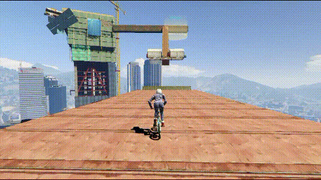
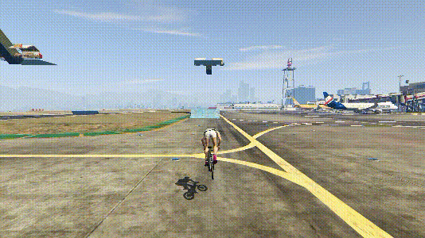
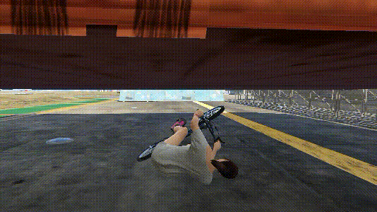
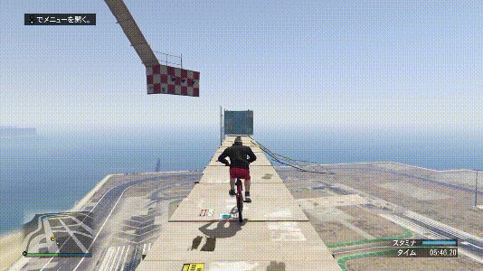
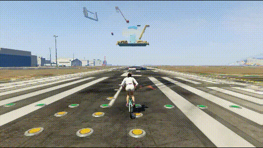

---
layout:
  title:
    visible: false
  description:
    visible: false
  tableOfContents:
    visible: true
  outline:
    visible: true
  pagination:
    visible: true
---

# 三角跳

## <mark style="color:blue;">**三角跳**</mark>🕹️ <a href="#san-jiao-tiao" id="san-jiao-tiao"></a>

***

前轮在斜面，后轮在地面，形成三角关系

<div align="left">

<figure><figcaption></figcaption></figure>

</div>

* 低帧更容易成功，遇到三角跳请立刻锁30\~45帧
* 起跳时先微微后拉，是为了砸的更有力
* 三角跳的高度和距离与速度也有关系

```plaintext
键盘：方向按键+空格
手柄：左摇杆+RB/R1
```

## <mark style="color:blue;">**其他技巧接三角跳（部分）**</mark>🕹️ <a href="#qi-ta-ji-qiao-jie-san-jiao-tiao-bu-fen" id="qi-ta-ji-qiao-jie-san-jiao-tiao-bu-fen"></a>

***

### **双板（或多板）三角跳** <a href="#shuang-ban-huo-duo-ban-san-jiao-tiao" id="shuang-ban-huo-duo-ban-san-jiao-tiao"></a>

***

<div align="left">

<figure><figcaption></figcaption></figure>

</div>

### **地滑接三角跳** <a href="#di-hua-jie-san-jiao-tiao" id="di-hua-jie-san-jiao-tiao"></a>

***

<div align="left">

<figure><figcaption></figcaption></figure>

</div>

唯一要注意的就是，地滑完毕之后快速起身前推即可。

> **【拓展思路】**其他技巧接三角跳：
>
> 🚩滑竿接三角跳
>
> 🚩轮滑接三角跳
>
> 🚩壁走接三角跳
>
> 🚩其他…

> 当然，三角跳也可以接其他技巧，但一般情况上只飞高飞远就可以了

## <mark style="color:blue;">**特殊的三角跳**</mark>🕹️ <a href="#te-shu-de-san-jiao-tiao" id="te-shu-de-san-jiao-tiao"></a>

***

### **反动三角跳** <a href="#fan-dong-san-jiao-tiao" id="fan-dong-san-jiao-tiao"></a>

***

反动姿势加上三角跳

<div align="left">

<figure><figcaption><p><a href="https://www.youtube.com/@R.e.t.r.o.m.a.n.i.A"><em>图源：Retro maniA</em></a></p></figcaption></figure>

</div>

### **倒三角跳** <a href="#dao-san-jiao-tiao" id="dao-san-jiao-tiao"></a>

***

倒过来的三角跳

<div align="left">

<figure><figcaption></figcaption></figure>

</div>

* 一般用来接拍地
* ~~不接拍地我直接开高帧磕后轮偷~~🤤
* ~~接拍地我也直接开高帧磕后轮偷~~🥵
