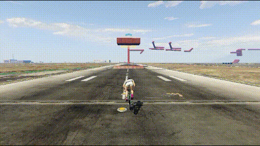
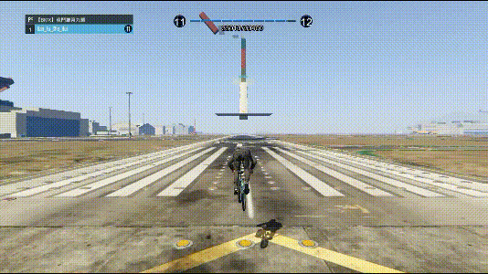

---
layout:
  title:
    visible: false
  description:
    visible: false
  tableOfContents:
    visible: true
  outline:
    visible: true
  pagination:
    visible: true
---

# 顶飞

## <mark style="color:blue;">**顶飞**</mark>🕹️ <a href="#ding-fei" id="ding-fei"></a>

***

速度足够的前提下，蓄力按住跳键，当前轮顶到突出的物体时，松开跳键同时按住刹车和前推

<div align="left">

<figure><figcaption></figcaption></figure>

</div>

* 低帧更容易成功，遇到顶飞请立刻锁30\~45帧
* 带刹车成功率会变高
* 顶飞的高度和距离与速度也有关系

```plaintext
键盘：方向按键+空格+Q
手柄：左摇杆+RB/R1+LT/L2
```

> **【拓展思路】**壁走也可以接顶飞，顶飞不仅仅是地面上的东西\~

## <mark style="color:blue;">**侧顶飞**</mark>🕹️ <a href="#ce-ding-fei" id="ce-ding-fei"></a>

***

又被称为**撩**

<div align="left">

<figure><figcaption></figcaption></figure>

</div>

* 可以当作畸形拍地，但和[顶飞拍](page-6-framebounces.md#ding-fei-pai)的动作不一样


```plaintext
键盘：方向按键+空格+Q
手柄：左摇杆+RB/R1+LT/L2
```
