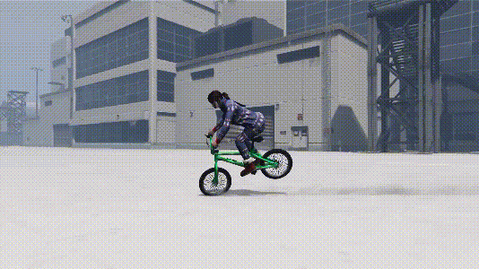
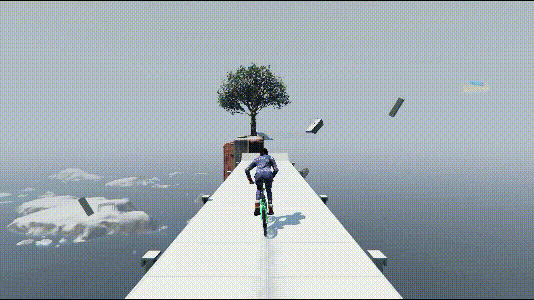
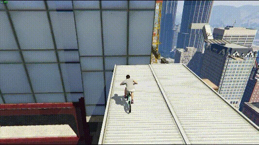
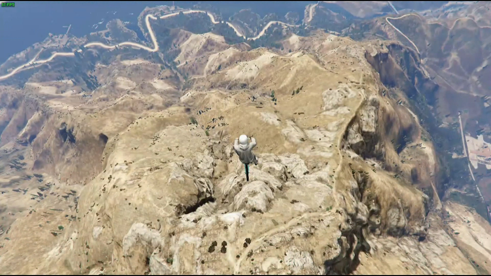
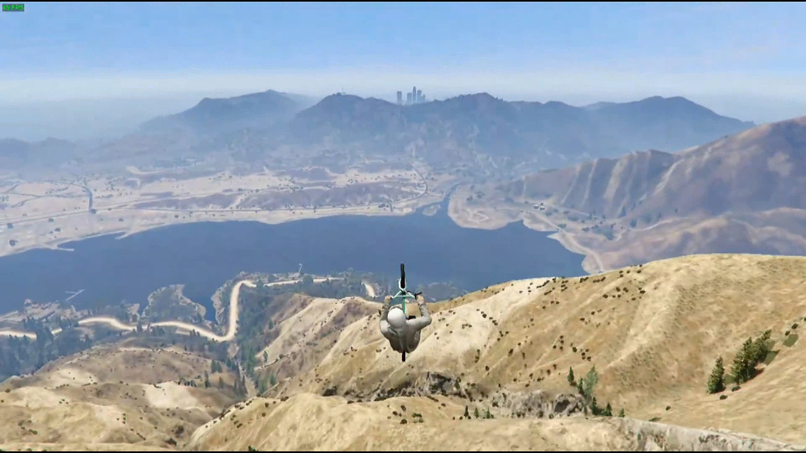
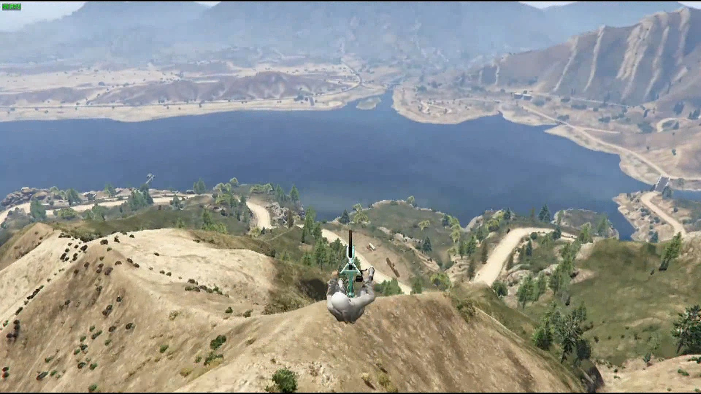
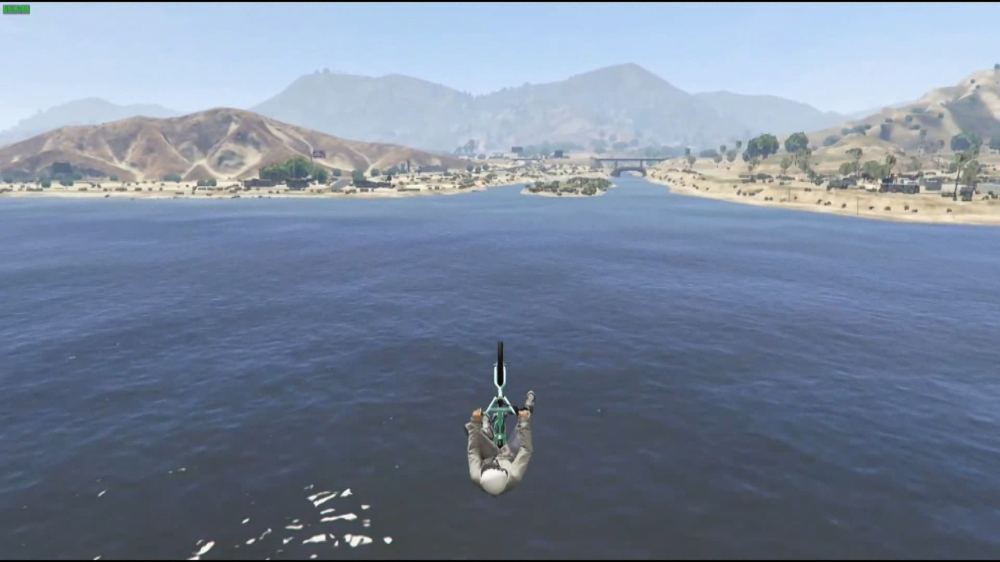
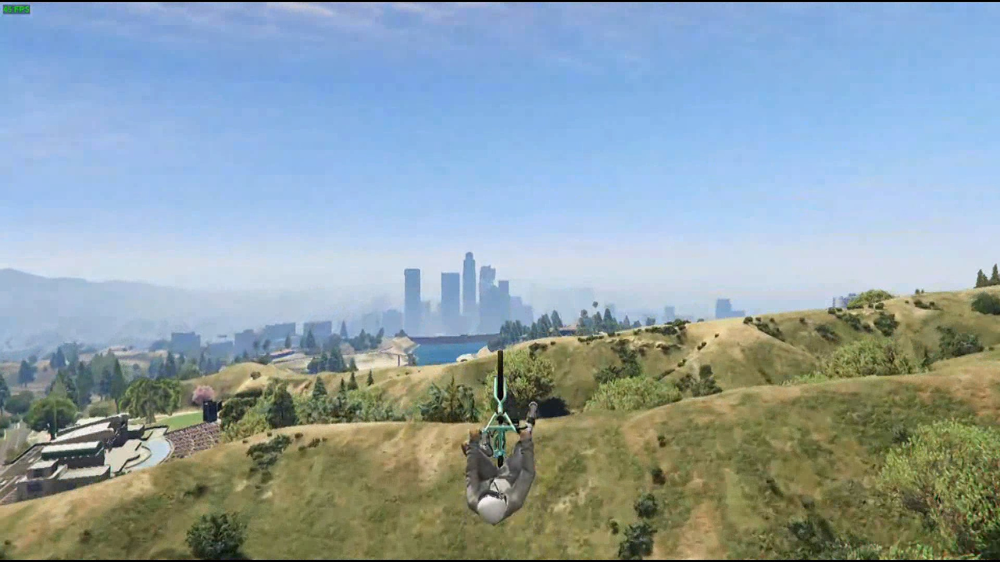

# 五大新手操作

## <mark style="color:blue;">**前轮骑**</mark>🕹️ <a href="#qian-lun-qi" id="qian-lun-qi"></a>

***

在有一定速度的前提下，前推+刹车按死

<div align="left">

<figure><figcaption></figcaption></figure>

</div>


左上或者右上方向抱死，绕圈前轮骑不会减速

只能平地或角度比较小的上坡使用该技巧


```plaintext
键盘：方向按键+Q
手柄：左摇杆+LT/L2
```

## <mark style="color:blue;">**拉车头**</mark>🕹️ <a href="#la-che-tou" id="la-che-tou"></a>

***

也可以叫做后轮骑，即前推秒按秒松，接着后拉并按加速

<div align="left">

<figure><figcaption></figcaption></figure>

</div>


如果后拉后松开加速，脱离物体的拉车头就可以变得更远更高

如果一直后拉并持续加速，可以保持翘后轮行驶


```plaintext
键盘：方向按键+Caps Lock ⇪（点击）+W（按住）
手柄：左摇杆+A（连击）/X（连击）
此处特别标注出了加速按键，所以要注意这个按键的使用
```

## <mark style="color:blue;">**拱**</mark>🕹️ <a href="#gong" id="gong"></a>

***

前推按死，跳键和加速键有规律的点按，让你保持在较大坡度的斜面上运动

<div align="left">

<figure><figcaption></figcaption></figure>

</div>


帧数越低，拱的距离越长，比如两节80°的箱子中间有较大空隙，想要拱过中间的空隙，最好把帧数限制在30\~45


```plaintext
键盘：方向按键+空格+Caps Lock ⇪（点击）+W（按住）
手柄：左摇杆+RB/R1+A（连击）/X（连击）
此处特别标注出了加速按键，所以要注意这个按键的使用
```

## <mark style="color:blue;">**日墙**</mark>🕹️ <a href="#ri-qiang" id="ri-qiang"></a>

***

前推按死，跳键和刹车键有规律的点按

<div align="left">

<figure><figcaption></figcaption></figure>

</div>


注意事项：

* 跳和刹车的点按节奏可以不同，根据车身平衡灵活调节各自的按键频率
* 对于高帧，日墙只是皮毛；对于低帧，日墙是神！是神！！



新手疑问

* 疑问一：网上有说使用手柄的前提下可以半推

答：不建议，完全前推推死，可以融合键盘和手柄的动作叫法

* 疑问二：网上有说前推+刹车键按死，跳键点按的方法

答：不建议，前推是让车身前仰，刹车是让前车轮吸附墙壁，日高墙会出现前仰过度的情况

* 疑问三：如何解决高度够了但是进不去

答：到所需高度的末端，松开前刹的同时后拉；或者重新再试一次

* 疑问四：哪里有日墙点啊，怎么找日墙图啊，学会了日墙就出师了嘛

答：日墙点战局里非常之多，用心寻找；日墙图可以在rockstar socialclub收藏，请参阅本wiki里的差事收藏教程


```plaintext
键盘：方向按键+空格+Q
手柄：左摇杆+RB/R1+LT/L
```

## <mark style="color:blue;">**滑翔**</mark>🕹️ <a href="#hua-xiang" id="hua-xiang"></a>

***

首先，起跳的位置高度至少要达到最高那座山c3的高度

<div align="left">

<figure><figcaption></figcaption></figure>

</div>

接着，从足够高的位置起跳，后拉，后拉……直到人物的头依然看着前方，不是看着天

<div align="left">

<figure><figcaption></figcaption></figure>

</div>

<div align="left">

<figure><figcaption></figcaption></figure>

</div>

紧接着，当滑翔下落加速阶段接近尾声，应该是掠过沙漠的那个湖或者听不到风声了

最后，慢慢后拉，人物头看着天，就是滑翔的起飞阶段了，后拉越多，上升越高，当然减速也最快，合理控制后拉的时间，可以滑的更远更高

<div align="left">

<figure><figcaption></figcaption></figure>

</div>

<div align="left">

<figure><figcaption></figcaption></figure>

</div>


★**滑翔转弯**，只需要按左右打平车身，然后前推后拉就可以;转弯不减速太多，需要在打平车身之前前推那么一点点，转弯时候前推后拉力度不要太大了，转的弯越快，减速也就越快，要慢慢转弯。

以上总结成一句话，_加速阶段后拉人头看前，起飞阶段后拉人头看天，转弯要打平车身且不能用力前推后拉。_


```plaintext
键盘：方向按键
手柄：左摇杆
```
