---
layout:
  title:
    visible: false
  description:
    visible: false
  tableOfContents:
    visible: true
  outline:
    visible: true
  pagination:
    visible: true
---

# 滑竿类

## <mark style="color:blue;">**滑竿**</mark>🕹️ <a href="#hua-gan" id="hua-gan"></a>

***

前车把靠上杆子

<div align="left">

<figure>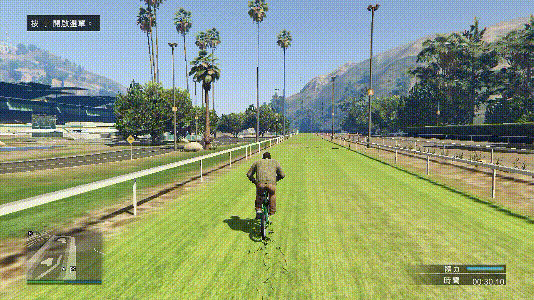<figcaption></figcaption></figure>

</div>


不同杆子要求不同的**前压角度**和**左右微调**



上杆比较考验对距离的把控，建议去跑马场一边转圈一边练习


```plaintext
键盘：方向按键+空格（翻杆跳时按）
手柄：左摇杆+RB/R1（翻杆跳时按）
```

### **滑竿正向翻杆** <a href="#hua-gan-zheng-xiang-fan-gan" id="hua-gan-zheng-xiang-fan-gan"></a>

***

<div align="left">

<figure>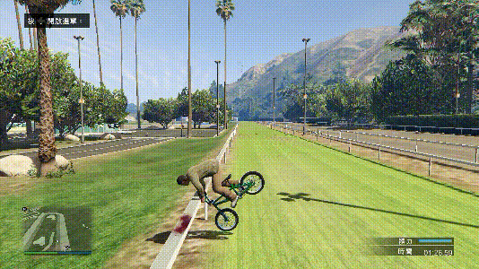<figcaption></figcaption></figure>

</div>

### **滑竿反向翻杆** <a href="#hua-gan-fan-xiang-fan-gan" id="hua-gan-fan-xiang-fan-gan"></a>

***

<div align="left">

<figure>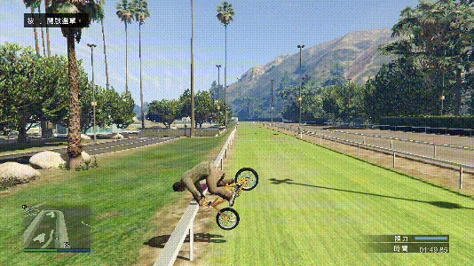<figcaption></figcaption></figure>

</div>

### **滑竿正向翻杆跳** <a href="#hua-gan-zheng-xiang-fan-gan-tiao" id="hua-gan-zheng-xiang-fan-gan-tiao"></a>

***

<div align="left">

<figure>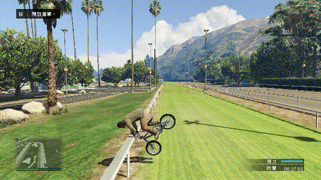<figcaption></figcaption></figure>

</div>

### **滑竿反向翻杆跳** <a href="#hua-gan-fan-xiang-fan-gan-tiao" id="hua-gan-fan-xiang-fan-gan-tiao"></a>

***

<div align="left">

<figure>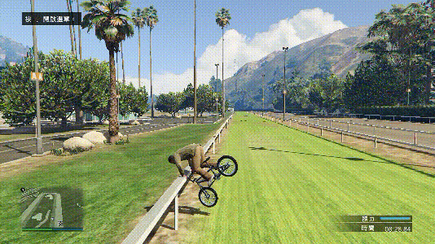<figcaption></figcaption></figure>

</div>

## <mark style="color:blue;">**屁股滑**</mark>🕹️ <a href="#pi-gu-hua" id="pi-gu-hua"></a>

***

实际上是滑坐垫的位置

<div align="left">

<figure>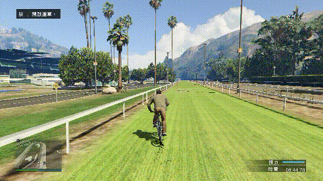<figcaption></figcaption></figure>

</div>


不同杆子要求不同的**前压角度**和**左右微调**



上杆比较考验对距离的把控，建议去跑马场一边转圈一边练习


```plaintext
键盘：方向按键+空格（翻杆跳时按）
手柄：左摇杆+RB/R1（翻杆跳时按）
```

### **屁股滑正向翻杆** <a href="#pi-gu-hua-zheng-xiang-fan-gan" id="pi-gu-hua-zheng-xiang-fan-gan"></a>

***

<div align="left">

<figure>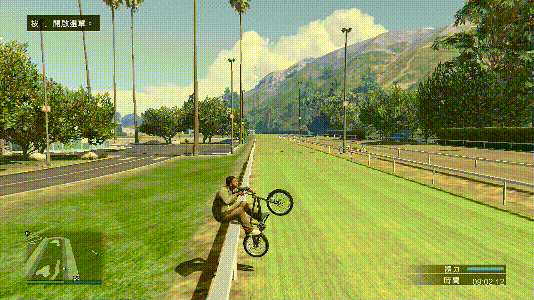<figcaption></figcaption></figure>

</div>

### **屁股滑反向翻杆** <a href="#pi-gu-hua-fan-xiang-fan-gan" id="pi-gu-hua-fan-xiang-fan-gan"></a>

***

<div align="left">

<figure>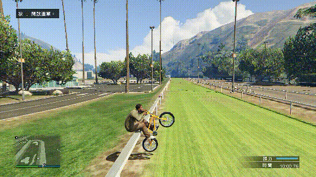<figcaption></figcaption></figure>

</div>

### **屁股滑正向翻杆跳** <a href="#pi-gu-hua-zheng-xiang-fan-gan-tiao" id="pi-gu-hua-zheng-xiang-fan-gan-tiao"></a>

***

<div align="left">

<figure>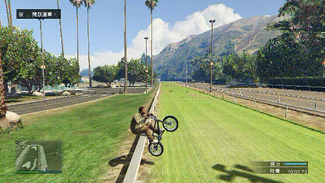<figcaption></figcaption></figure>

</div>

### **屁股滑反向翻杆跳** <a href="#pi-gu-hua-fan-xiang-fan-gan-tiao" id="pi-gu-hua-fan-xiang-fan-gan-tiao"></a>

***

<div align="left">

<figure>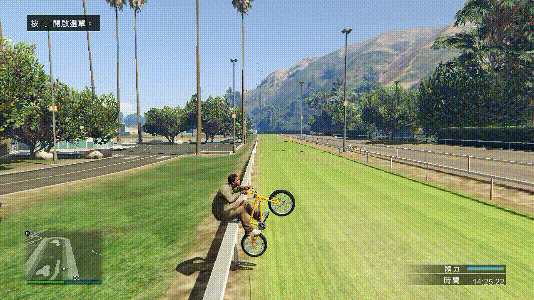<figcaption><p><del>动作没做好没有跳起来，后续完善映射时再补档</del></p></figcaption></figure>

</div>

## <mark style="color:blue;">**夹杆滑（裆滑）**</mark>🕹️ <a href="#jia-gan-hua-dang-hua" id="jia-gan-hua-dang-hua"></a>

***

用车子中间去夹着滑

<div align="left">

<figure>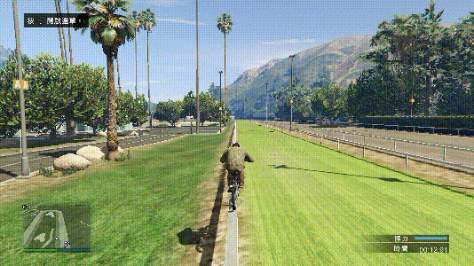<figcaption></figcaption></figure>

</div>


可以调整前后方向来平衡车身



想达到卡完美状态，需要尽量模仿标准动作


```plaintext
键盘：方向按键
手柄：左摇杆
```

### **夹杆跳** <a href="#jia-gan-tiao" id="jia-gan-tiao"></a>

***

夹杆滑（裆滑）时跳跃一下

<div align="left">

<figure>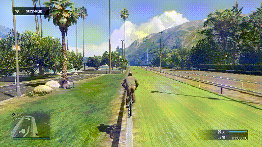<figcaption></figcaption></figure>

</div>


跳的时候可以加上前推



跳的时候也可以再加上刹车，可以出来一种拍地的效果，姑且称作“夹杆拍”


```plaintext
键盘：方向按键+空格+Q（不必须）
手柄：左摇杆+RB/R1+LT/L2（不必须）
```

### **侧夹杆跳** <a href="#ce-jia-gan-tiao" id="ce-jia-gan-tiao"></a>

***

前轮滑和后轮滑的姿势侧平车身夹杆跳（拍）

<div align="left">

<figure>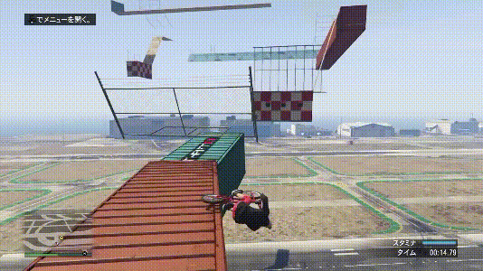<figcaption><p><a href="https://www.youtube.com/@R.e.t.r.o.m.a.n.i.A"><em>图源：Retro maniA</em></a></p></figcaption></figure>

</div>


侧夹杆跳不等同于后轮拍，只是动作比较相似


```plaintext
键盘：方向按键+空格+Q
手柄：左摇杆+RB/R1+LT/L2
```
