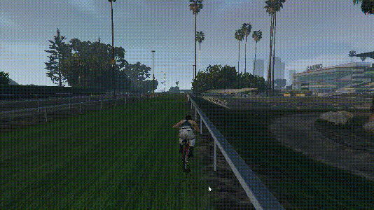
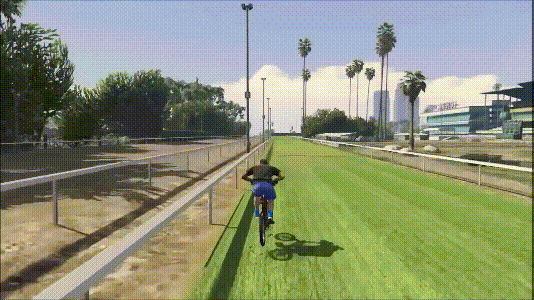
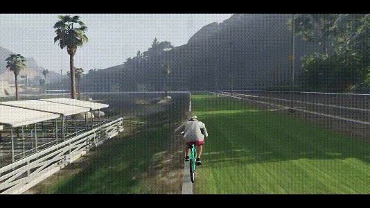
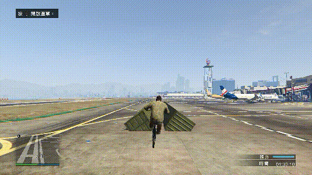
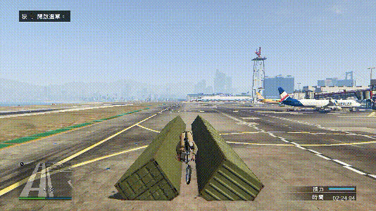
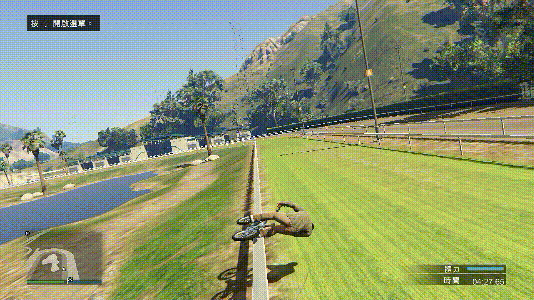
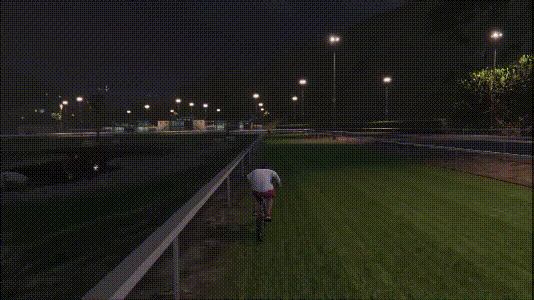

---
layout:
  title:
    visible: false
  description:
    visible: false
  tableOfContents:
    visible: true
  outline:
    visible: true
  pagination:
    visible: true
---

# 轮滑类

## <mark style="color:blue;">**常规四种轮滑**</mark>🕹️ <a href="#chang-gui-si-zhong-lun-hua" id="chang-gui-si-zhong-lun-hua"></a>

***

### **前轮滑** <a href="#qian-lun-hua" id="qian-lun-hua"></a>

***

前轮靠近屏幕，后轮远离屏幕，一般前轮在上，后轮在下

<div align="left">

<figure><figcaption></figcaption></figure>

</div>


前轮滑卡完美是根据车把位置，所以前后轮上下位置不严格也可以



无论通过砸车头、拉车头或者其他动作技巧接前轮滑摆姿势的时候，一开始的后拉不要过多，放平车身之后往杆子内打方向，最后再稍微后拉调整，即可卡出完美角度


```plaintext
键盘：方向按键+空格
手柄：左摇杆+RB/R1
```

### **后轮滑** <a href="#hou-lun-hua" id="hou-lun-hua"></a>

***

前轮远离屏幕，后轮靠近屏幕，一般前轮在下，后轮在上

<div align="left">

<figure><figcaption></figcaption></figure>

</div>


把后轮滑和放平车身的滑翔联系在一起，当滑翔时，左右打方向放平车身，单车会往双轮正对的地方滑，所以当有个东西即轮滑的杆子或道具阻止单车往一个方向滑，正1加负1等0，这种单方向滑就被抵消了，后轮滑就可以卡出完美角度了



和前轮滑一样，摆姿势的时候不要后拉太多，摆好姿势后，稍微前推一下即可保持完美的后轮滑了



**进阶-后轮（滑）弹**

* 一般是在后轮滑快出杆的时候，往里打方向的同时后拉
* 一般是弹船板道具、表面光滑但实际不规整的屋檐、露出来的小道具或者道具露出来小坎


```plaintext
键盘：方向按键+空格
手柄：左摇杆+RB/R1
```

### **倒后轮滑** <a href="#dao-hou-lun-hua" id="dao-hou-lun-hua"></a>

***

后轮滑倒过来的姿势（下图二连动作仅供参考，也可以通过其他动作来衔接倒后轮滑）

<div align="left">

<figure><figcaption><p><a href="https://www.youtube.com/channel/UCQ1qVyysgIYvvuHncwCVmLg"><em>图源：Royalty</em></a></p></figcaption></figure>

</div>


衔接部分（即砸后轮接倒后轮滑部分）需要按刹车



适当多前推，会砸的高



砸后轮同时前推和左（或右）



动作完成后可适当反打右（或左）接上滑起来的部分


```plaintext
键盘：方向按键+空格+Q
手柄：左摇杆+RB/R1+LT/L2
```

### **倒前轮滑** <a href="#dao-qian-lun-hua" id="dao-qian-lun-hua"></a>

***

前轮滑倒过来的姿势（下图二连动作仅供参考，也可以通过其他动作来衔接倒前轮滑）

<div align="left">

<figure><figcaption><p><a href="https://www.youtube.com/channel/UCQ1qVyysgIYvvuHncwCVmLg"><em>图源：Royalty</em></a></p></figcaption></figure>

</div>



衔接部分（即砸后轮接倒前轮滑部分）需要按刹车



适当多前推，会砸的高



砸后轮先前推，再左（或右），接着再前推



动作完成后可适当反打右（或左）接上滑起来的部分


```plaintext
键盘：方向按键+空格+Q
手柄：左摇杆+RB/R1+LT/L2
```

## <mark style="color:blue;">**非常规四种轮滑**</mark>🕹️ <a href="#fei-chang-gui-si-zhong-lun-hua" id="fei-chang-gui-si-zhong-lun-hua"></a>

***

暂时仅提供动画演示做参考，能把上面的常规四种学会，下面的非常规四种就不需要标注了吧？

### **双轮滑** <a href="#shuang-lun-hua" id="shuang-lun-hua"></a>

***

<div align="left">

<figure><figcaption></figcaption></figure>

</div>

### **倒双轮滑** <a href="#dao-shuang-lun-hua" id="dao-shuang-lun-hua"></a>

***

<div align="left">

<figure><figcaption></figcaption></figure>

</div>

### **侧双轮滑** <a href="#ce-shuang-lun-hua" id="ce-shuang-lun-hua"></a>

***

<div align="left">

<figure><figcaption></figcaption></figure>

</div>

### **侧倒双轮滑** <a href="#ce-dao-shuang-lun-hua" id="ce-dao-shuang-lun-hua"></a>

***

<div align="left">

<figure><figcaption><p><a href="https://www.youtube.com/channel/UCQ1qVyysgIYvvuHncwCVmLg"><em>图源：Royalty</em></a></p></figcaption></figure>

</div>
