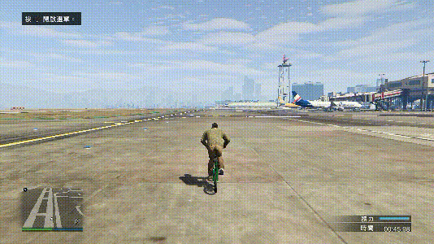
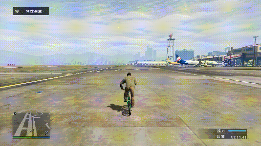
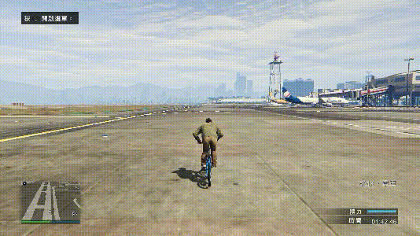
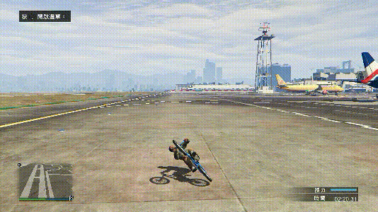
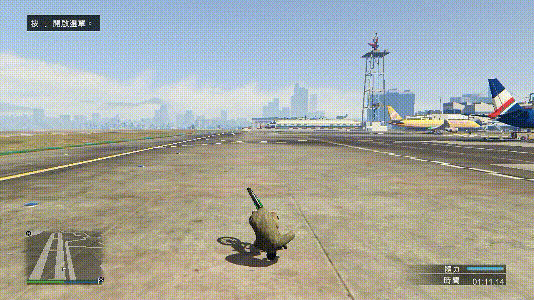
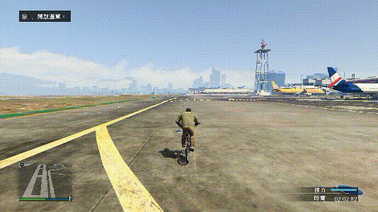

---
layout:
  title:
    visible: false
  description:
    visible: false
  tableOfContents:
    visible: true
  outline:
    visible: true
  pagination:
    visible: true
---

# 地滑类

## <mark style="color:blue;">**地滑**</mark>🕹️ <a href="#di-hua" id="di-hua"></a>

***

### **砸车头接地滑** <a href="#za-che-tou-jie-di-hua" id="za-che-tou-jie-di-hua"></a>

***

后轮在地面上滑行，人物靠近屏幕

<div align="left">

<figure><figcaption></figcaption></figure>

</div>



根据普通跳跃所学[砸车头](page-1-jumps.md#za-che-tou)，后拉不要太多，在空中摆出地滑角度，落地反打左右方向一次来保持稳定



可以随意微调方向，但不要幅度太大



由于材质特性，在道具上地滑相较于地面，会更难滑起来


```plaintext
键盘：方向按键+空格
手柄：左摇杆+RB/R1
```

### **直接后拉接地滑** <a href="#zhi-jie-hou-la-jie-di-hua" id="zhi-jie-hou-la-jie-di-hua"></a>

***

<div align="left">

<figure><figcaption></figcaption></figure>

</div>

## <mark style="color:blue;">**头滑**</mark>🕹️ <a href="#tou-hua" id="tou-hua"></a>

***

前轮在地面上滑行，人物远离屏幕

<div align="left">

<figure><figcaption></figcaption></figure>

</div>


学习角度即可，可联动后面[砸后轮](page-8-jumps-2.md)自己深入学习


```plaintext
键盘：方向按键+空格+Q（砸后轮时用到）
手柄：左摇杆+RB/R1+LT/L2（砸后轮时用到）
```

## <mark style="color:blue;">**倒地滑**</mark>🕹️ <a href="#dao-di-hua" id="dao-di-hua"></a>

***

后轮在地面上滑行，人物远离屏幕

<div align="left">

<figure><figcaption><p>只演示倒地滑的姿势角度</p></figcaption></figure>

</div>


虽然不能通过简单的跳来做出动作，但在平地上非常多的技巧可以衔接倒地滑，也可以由倒地滑来衔接非常多的技巧



通常是接拍地，拍地部分再提，极少数情况接滑竿、轮滑、其他类型地滑或者其他BMX动作技巧


```plaintext
键盘：方向按键
手柄：左摇杆
```

## <mark style="color:blue;">**倒头滑**</mark>🕹️ <a href="#dao-tou-hua" id="dao-tou-hua"></a>

***

在地面上滑行，人物靠近屏幕

<div align="left">

<figure><figcaption><p>只演示倒头滑的姿势角度</p></figcaption></figure>

</div>


虽然不能通过简单的跳来做出动作，但在平地上非常多的技巧可以衔接倒头滑，也可以由倒头滑来衔接非常多的技巧


```plaintext
键盘：方向按键
手柄：左摇杆
```

## <mark style="color:blue;">**反动斜地滑**</mark>🕹️ <a href="#fan-dong-xie-di-hua" id="fan-dong-xie-di-hua"></a>

***

<div align="left">

<figure><figcaption></figcaption></figure>

</div>


适用于斜着地滑的点，结合普通跳跃里的[反动跳](page-1-jumps.md#fan-dong-tiao)以及普通[地滑](page-5-hipster-cut-slides.md#di-hua)来学习



本章节另外三种滑也可以做出斜着滑，但~~暂时~~没有**反动斜地滑**实用性高

