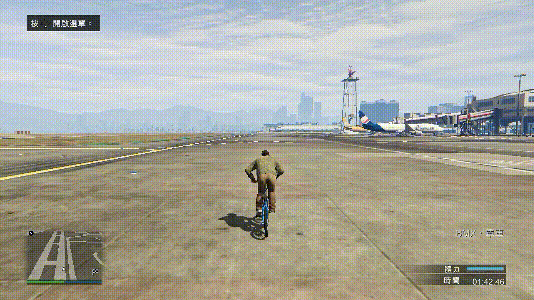

---
layout:
  title:
    visible: false
  description:
    visible: false
  tableOfContents:
    visible: true
  outline:
    visible: true
  pagination:
    visible: true
---

# 砸后轮

## <mark style="color:blue;">**砸后轮**</mark>🕹️ <a href="#za-hou-lun" id="za-hou-lun"></a>

***

### **砸后轮** <a href="#za-hou-lun" id="za-hou-lun"></a>

***

先稍微后拉单车，然后空中按跳蓄力，最后双轮或前轮落地前推+刹车+跳

<div align="left">

<figure><figcaption></figcaption></figure>

</div>


低帧双轮落地砸，高帧前轮落地砸


```plaintext
键盘：方向按键+空格+Q
手柄：左摇杆+RB/R1+LT/L2
```

### **反动砸后轮** <a href="#fan-dong-za-hou-lun" id="fan-dong-za-hou-lun"></a>

***

带上左右方向的砸后轮，起名参考了反动跳

<div align="left">

<figure><figcaption></figcaption></figure>

</div>

## <mark style="color:blue;">**常见砸后轮接技巧（部分）**</mark>🕹️ <a href="#chang-jian-za-hou-lun-jie-ji-qiao-bu-fen" id="chang-jian-za-hou-lun-jie-ji-qiao-bu-fen"></a>

***

### **砸后轮接头滑** <a href="#za-hou-lun-jie-tou-hua" id="za-hou-lun-jie-tou-hua"></a>

***

<div align="left">

<figure><figcaption></figcaption></figure>

</div>

### **砸后轮接倒滑** <a href="#za-hou-lun-jie-dao-hua" id="za-hou-lun-jie-dao-hua"></a>

***

<div align="left">

<figure><figcaption></figcaption></figure>

</div>

### **砸后轮接拍地** <a href="#za-hou-lun-jie-pai-di" id="za-hou-lun-jie-pai-di"></a>

***

<div align="left">

<figure><figcaption></figcaption></figure>

</div>

### **砸后轮接倒后轮滑** <a href="#za-hou-lun-jie-dao-hou-lun-hua" id="za-hou-lun-jie-dao-hou-lun-hua"></a>

***

<div align="left">

<figure><figcaption><p><a href="https://www.youtube.com/channel/UCQ1qVyysgIYvvuHncwCVmLg"><em>图源：Royalty</em></a></p></figcaption></figure>

</div>

### **砸后轮接倒前轮滑** <a href="#za-hou-lun-jie-dao-qian-lun-hua" id="za-hou-lun-jie-dao-qian-lun-hua"></a>

***

<div align="left">

<figure><figcaption><p><a href="https://www.youtube.com/channel/UCQ1qVyysgIYvvuHncwCVmLg"><em>图源：Royalty</em></a></p></figcaption></figure>

</div>

### **反动砸后轮接斜倒头滑** <a href="#fan-dong-za-hou-lun-jie-xie-dao-tou-hua" id="fan-dong-za-hou-lun-jie-xie-dao-tou-hua"></a>

***

<div align="left">

<figure><figcaption></figcaption></figure>

</div>
