---
layout:
  title:
    visible: false
  description:
    visible: false
  tableOfContents:
    visible: true
  outline:
    visible: true
  pagination:
    visible: true
---

# 斜面壁走

## <mark style="color:blue;">**斜面壁走**</mark>🕹️ <a href="#xie-mian-bi-zou" id="xie-mian-bi-zou"></a>

***

在斜面上侧着骑行

> 难点就是能否衔接上壁走姿势，只要摆出姿势，即可壁走
>
> 以下部分技巧接斜面壁走的方法与姿势仅供参考，根据实战自行尝试

```plaintext
键盘：方向按键+Caps Lock ⇪（点击）+W（按住）
手柄：左摇杆+A（连击）/X（连击）
```

## <mark style="color:blue;">**其他技巧接壁走（部分）**</mark>🕹️ <a href="#qi-ta-ji-qiao-jie-bi-zou-bu-fen" id="qi-ta-ji-qiao-jie-bi-zou-bu-fen"></a>

***

### **跳跳后拉接斜面壁走** <a href="#tiao-tiao-hou-la-jie-xie-mian-bi-zou" id="tiao-tiao-hou-la-jie-xie-mian-bi-zou"></a>

***

<div align="left">

<figure>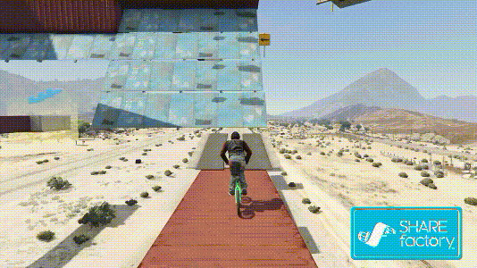<figcaption><p><a href="https://www.youtube.com/@R.e.t.r.o.m.a.n.i.A"><em>图源：Retro maniA</em></a></p></figcaption></figure>

</div>


2015年最出圈的斜面壁走，出自大名鼎鼎的SBMX挑战状，图的作者是Retro maniA


### **单板接斜面壁走** <a href="#dan-ban-jie-xie-mian-bi-zou" id="dan-ban-jie-xie-mian-bi-zou"></a>

***

<div align="left">

<figure>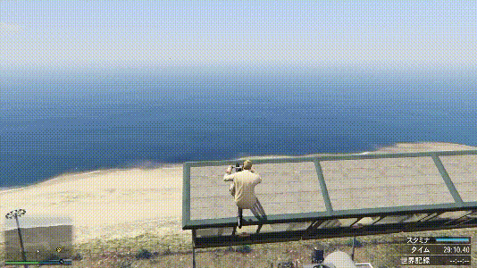<figcaption><p><a href="https://www.youtube.com/channel/UCtlLArQ7uzzIwd2EmO3fWVA"><em>图源：Kento</em></a></p></figcaption></figure>

</div>

### **拉车头接斜面壁走1** <a href="#la-che-tou-jie-xie-mian-bi-zou-1" id="la-che-tou-jie-xie-mian-bi-zou-1"></a>

***

<div align="left">

<figure>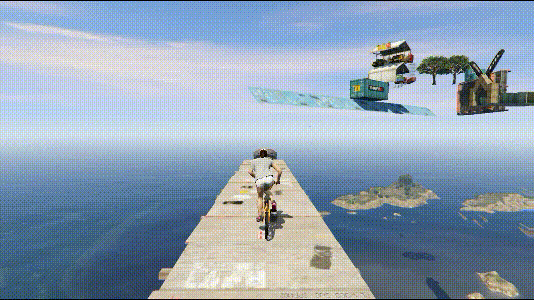<figcaption></figcaption></figure>

</div>

### **拉车头接斜面壁走2** <a href="#la-che-tou-jie-xie-mian-bi-zou-2" id="la-che-tou-jie-xie-mian-bi-zou-2"></a>

***

<div align="left">

<figure>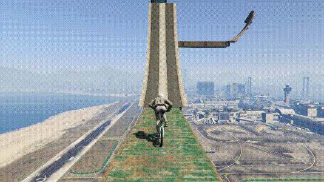<figcaption></figcaption></figure>

</div>

### **拉车头接斜面壁走3** <a href="#la-che-tou-jie-xie-mian-bi-zou-3" id="la-che-tou-jie-xie-mian-bi-zou-3"></a>

***

<div align="left">

<figure>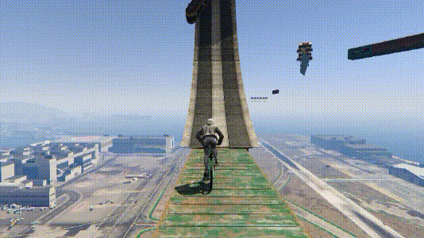<figcaption></figcaption></figure>

</div>

### **双大跳接斜面壁走** <a href="#shuang-da-tiao-jie-xie-mian-bi-zou" id="shuang-da-tiao-jie-xie-mian-bi-zou"></a>

***

<div align="left">

<figure>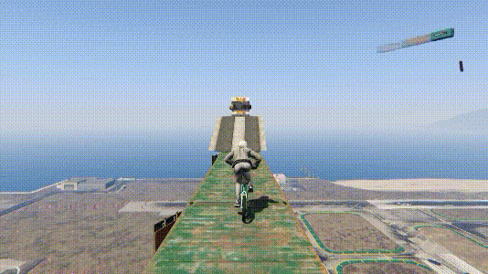<figcaption></figcaption></figure>

</div>

### **推撇接斜面壁走** <a href="#tui-pie-jie-xie-mian-bi-zou" id="tui-pie-jie-xie-mian-bi-zou"></a>

***

<div align="left">

<figure>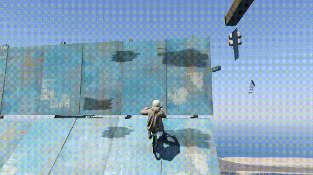<figcaption></figcaption></figure>

</div>

### **砸车头接斜面壁走** <a href="#za-che-tou-jie-xie-mian-bi-zou" id="za-che-tou-jie-xie-mian-bi-zou"></a>

***

<div align="left">

<figure>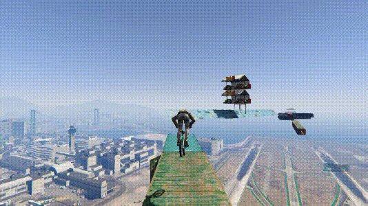<figcaption></figcaption></figure>

</div>

### **前轮滑接斜面壁走** <a href="#qian-lun-hua-jie-xie-mian-bi-zou" id="qian-lun-hua-jie-xie-mian-bi-zou"></a>

***

<div align="left">

<figure>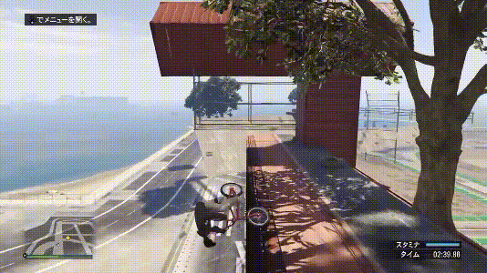<figcaption><p><a href="https://www.youtube.com/@R.e.t.r.o.m.a.n.i.A"><em>图源：Retro maniA</em></a></p></figcaption></figure>

</div>

### **后轮滑接斜面壁走** <a href="#hou-lun-hua-jie-xie-mian-bi-zou" id="hou-lun-hua-jie-xie-mian-bi-zou"></a>

***

<div align="left">

<figure>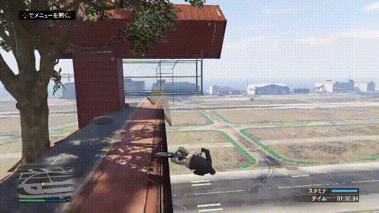<figcaption><p><a href="https://www.youtube.com/@R.e.t.r.o.m.a.n.i.A"><em>图源：Retro maniA</em></a></p></figcaption></figure>

</div>

### **倒后轮滑接斜面壁走** <a href="#dao-hou-lun-hua-jie-xie-mian-bi-zou" id="dao-hou-lun-hua-jie-xie-mian-bi-zou"></a>

***

<div align="left">

<figure>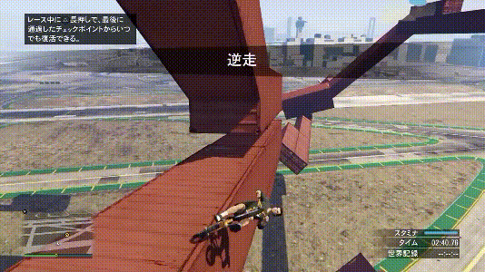<figcaption><p><a href="https://www.youtube.com/channel/UCpkNxJB0YozGkTZm6rH7PXg"><em>图源：naru</em></a></p></figcaption></figure>

</div>

### **倒前轮滑接斜面壁走** <a href="#dao-qian-lun-hua-jie-xie-mian-bi-zou" id="dao-qian-lun-hua-jie-xie-mian-bi-zou"></a>

***

<div align="left">

<figure>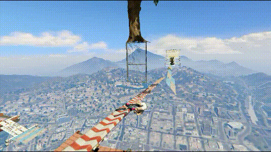<figcaption></figcaption></figure>

</div>

### **滑竿接斜面壁走** <a href="#hua-gan-jie-xie-mian-bi-zou" id="hua-gan-jie-xie-mian-bi-zou"></a>

***

<div align="left">

<figure>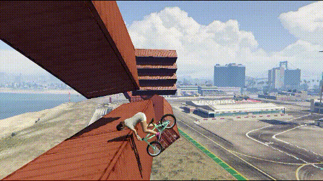<figcaption></figcaption></figure>

</div>

### **屁股滑接斜面壁走** <a href="#pi-gu-hua-jie-xie-mian-bi-zou" id="pi-gu-hua-jie-xie-mian-bi-zou"></a>

***

<div align="left">

<figure>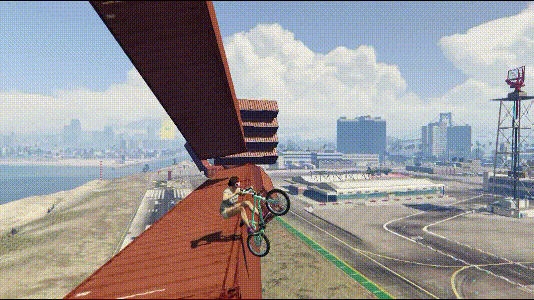<figcaption></figcaption></figure>

</div>

## <mark style="color:blue;">**壁走接其他技巧（部分）**</mark>🕹️ <a href="#bi-zou-jie-qi-ta-ji-qiao-bu-fen" id="bi-zou-jie-qi-ta-ji-qiao-bu-fen"></a>

***

### **多段壁走** <a href="#duo-duan-bi-zou" id="duo-duan-bi-zou"></a>

***

<div align="left">

<figure>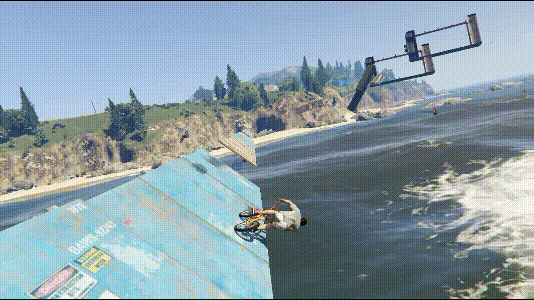<figcaption></figcaption></figure>

</div>


一般情况下，起跳之后要先后拉再前推



少数情况下方向不用动，只需要按跳



更少数情况下，两个壁走非常近或者距离刚刚好，可以壁走骑过去直接进行下一段壁走


```plaintext
键盘：方向按键+空格
手柄：左摇杆+RB/R1
```

### **壁走后拉跳** <a href="#bi-zou-hou-la-tiao" id="bi-zou-hou-la-tiao"></a>

***

壁走的末尾用后轮蹭墙跳出去

<div align="left">

<figure>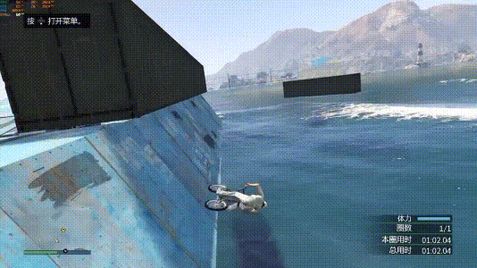<figcaption></figcaption></figure>

</div>


低帧（小于40帧）比较容易做出来



需要按住加速键后拉


```plaintext
键盘：方向按键+空格+W（按住）
手柄：左摇杆+RB/R1+A（按住）/X（按住）
```

### **壁走接斜面拍地** <a href="#bi-zou-jie-xie-mian-pai-di" id="bi-zou-jie-xie-mian-pai-di"></a>

***

<div align="left">

<figure>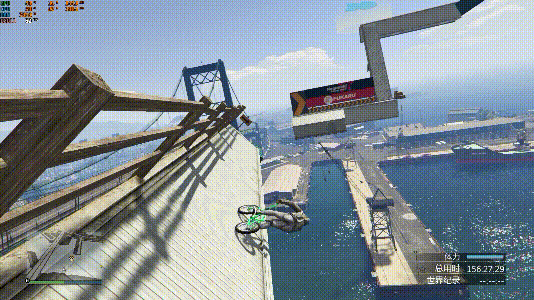<figcaption></figcaption></figure>

</div>


摆拍地姿势就行了，管它斜不斜面，拍！



高帧容易出奇迹，~~低帧也不是不可以，入门难一些~~


```plaintext
键盘：方向按键+空格+Q
手柄：左摇杆+RB/R1+LT/L2
```

> 壁走还能接其他技巧，这里就不举例了
